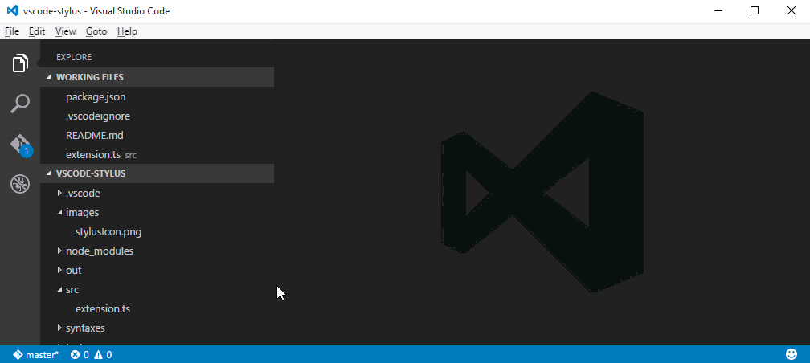

# vscode-stylus

## Stylus Language Support for Visual Studio Code
The only extension you'll ever need for Stylus support in Visual Studio Code.

If you would love to use VS Code, but the lack of Stylus support was a stumbling block for you, now you can take advantage of the Stylus Language Support extension for Visual Studio Code.

## Installing
  

- Open Visual Studio Code, then press `F1` and type `ext`.
- When you see the option `Extensions: Install Extension`, select it.
- Type `stylus` and choose the extension created by Vitor Buzinaro

## Features
- Coloring
- Full intellisense (under development)
- Tooltips, errors and warnings (under development)

## Contributing

### Question, Bugs or Feature Requests
Just [open an issue](https://github.com/buzinas/vscode-stylus/issues).

### Development
If you found a bug, and want to help, first, open an issue.

As soon as your issue is accepted, if you wanna help with the development, you must follow these steps:

1. Go to the accepted open issue, and comment that you're going to contribute.
- Fork this repository
- Clone your fork to a local git. E.g: `git clone https://github.com/[your-name]/vscode-stylus.git`
- Run `npm install`
- Open Visual Studio Code and press `CTRL+SHIFT+T` (`CMD+SHIFT+T` on MAC) to run the tests
- Press `F5` and you'll be able to run the VS Code development version
- When modifying/creating, there are some coding conventions:
  - File names: `virtual-file.ts`
  - File names for tests: `virtual-file.test.ts`
  - Class names: `class VirtualFile { }`
  - Interfaces: `interface IVirtualFileOptions { }`
  - Constant literals: `const FILE_NAME = 'stylus.styl';`
  - Methods, functions, variables, parameters: `function getFileNames(path: string): Array<string>`
  - Casting: `let token = (node as ts.BinaryExpression).operatorToken;`
  - All the other `tslint` specified conventions
- Write/modify the tests according to the new feature/fix you're going to code
- Make any needed changes/adjustments to fit the issue description
- Run the tests again
- When everything is working as expected, make a commit with the following conventions:
  - `[%type%] %description% (closes #%issue number%)`
  - Available types: feat, fix, docs, patch
  - Examples:
    - `[feat] intellisense support (closes #5)`
    - `[fix] correctly showing properties (closes #18)`
    - `[docs] intellisense examples (closes #12)`
    - `[perf] improved intellisense (closes #21)`
    - `[patch] better intellisense readability (closes #14)`
- Push your changes to Github
- Open a Pull Request in our repository from yours

Note: you can contribute to any accepted open issue, not only yours.

## Author
Vitor Buzinaro

## License
MIT
